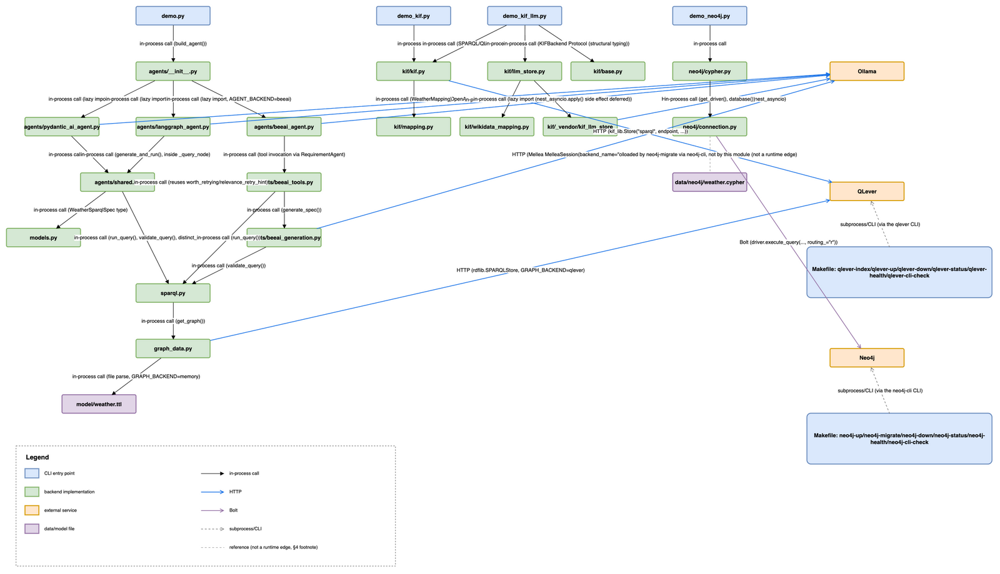
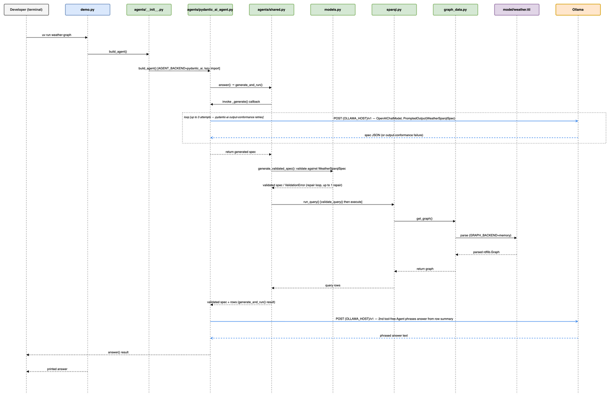
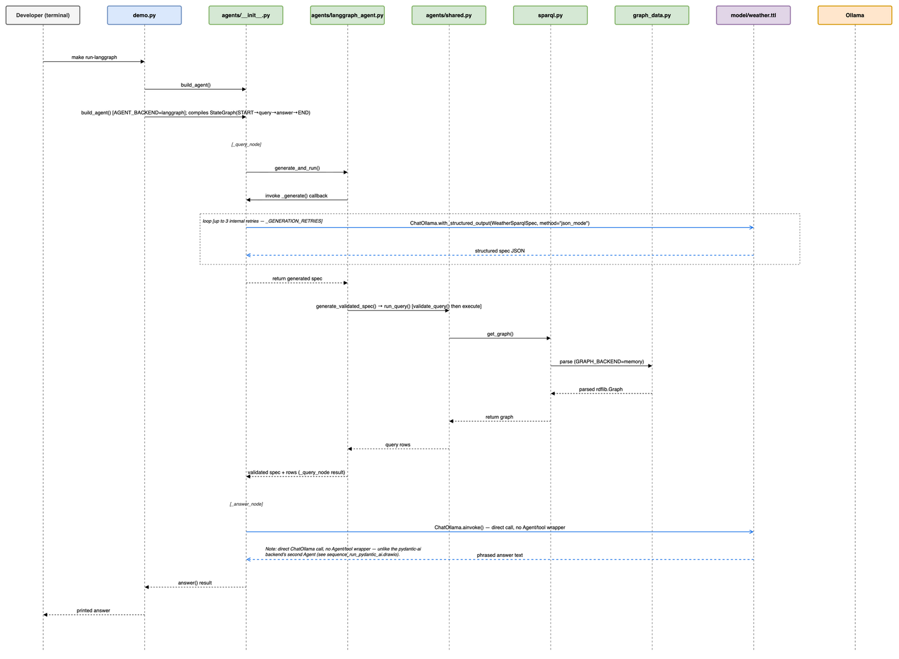
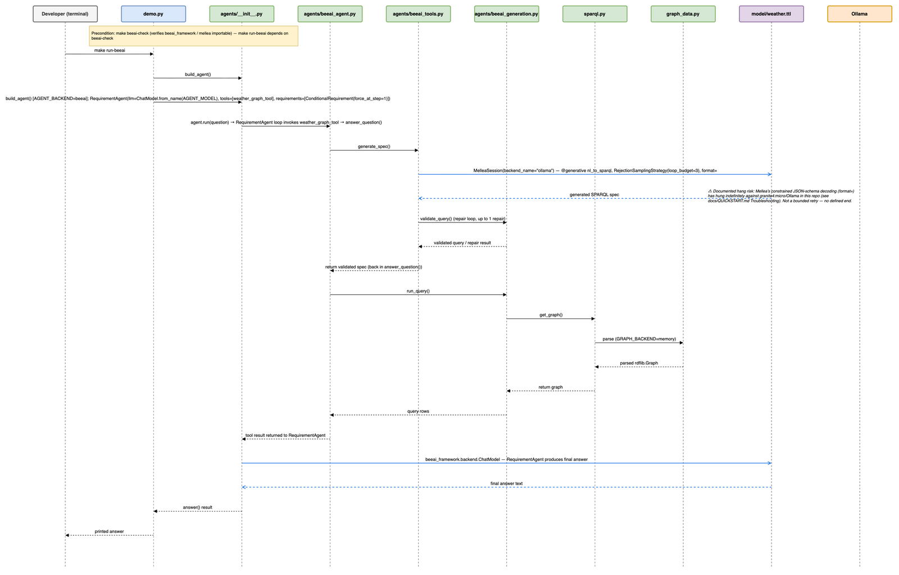
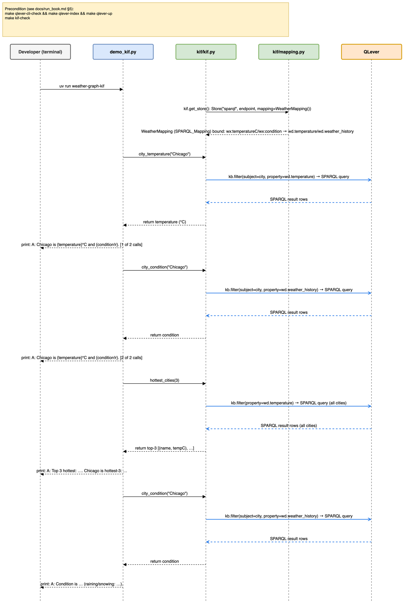
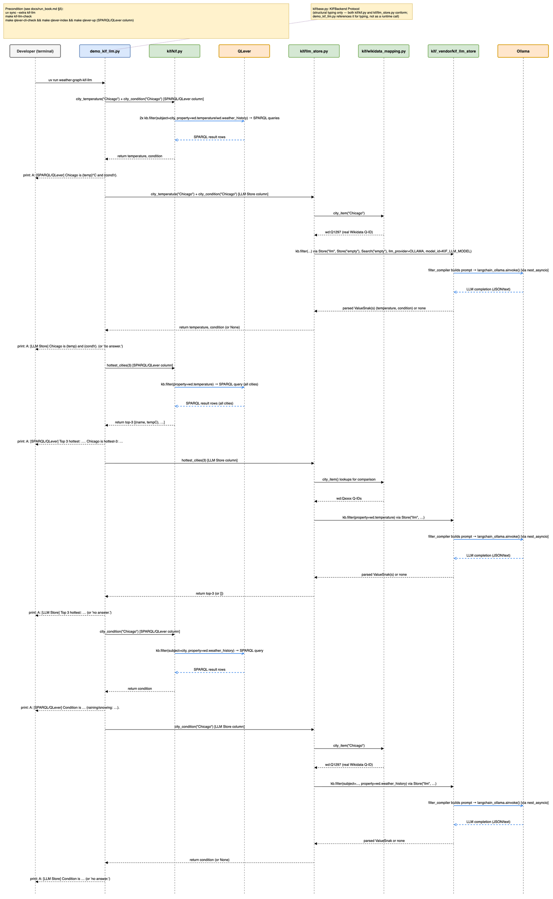
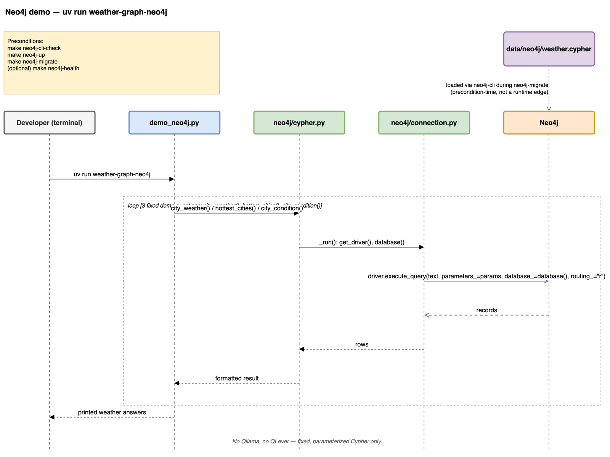

# learning_plan_drawio.md — architecture diagrams (draw.io)

This is the prose companion to `plans/PLAN_DRAWIO.md`'s deliverable: seven hand-authored
[draw.io](https://draw.io) (diagrams.net) `.drawio` files under `diagrams/` — one structural
component diagram of the whole system, plus one sequence diagram per major runtime scenario. It
follows the same "prose companion to a generated artifact" pattern as
[learning_plan_kif_llm.md](learning_plan_kif_llm.md): the diagrams are the source of truth, this
doc is the map to them.

## How to open the diagrams

Each `.drawio` file is plain mxGraph XML with no image/screenshot step. Open it in either:

- [app.diagrams.net](https://app.diagrams.net) → File → Open, or drag the file in.
- The [draw.io VS Code extension](https://marketplace.visualstudio.com/items?itemName=hediet.vscode-drawio)
  — opens `.drawio` files inline in the editor.

`make diagrams-check` verifies every `diagrams/*.drawio` file is well-formed XML (catches a
corrupted/truncated write). It does **not** check visual correctness (overlapping shapes, legible
labels) or style consistency against the shared guide — those were checked once, by hand, in the
reconciliation pass below, and stay a human review step for any future edit.

For a quick look without opening draw.io at all, every diagram also has a static `.png` preview
under `diagrams/`, embedded inline below (`## Diagram previews`) — see `plans/PLAN_EXPORT_PNG.md`
for how those are generated (`make diagrams-export`, via the draw.io desktop CLI). The `.drawio`
file is always the editable source of truth; the `.png` is a generated preview that **can go
stale** — there's no auto-regeneration hook, so re-run `make diagrams-export` after editing any
`.drawio` file and this doc's images won't reflect the edit until you do.

## The scenario catalog

Six major runtime scenarios, matching `docs/run_book.md`'s "Quick reference: what needs what"
table exactly (the offline `uv run pytest` suite is excluded — no interesting runtime *sequence*
to draw). Full detail — entry-point commands, `AGENT_BACKEND`/`GRAPH_BACKEND` values, real import
chains traced from source, and every external service touched — lives in
[../analysis/drawio_scenarios_analysis.md](../analysis/drawio_scenarios_analysis.md); this table
is the short index.

| # | Scenario | Entry point | Diagram |
|---|---|---|---|
| 1 | Default pydantic-ai run | `uv run weather-graph` | [diagrams/sequence_run_pydantic_ai.drawio](../diagrams/sequence_run_pydantic_ai.drawio) |
| 2 | LangGraph run | `make run-langgraph` | [diagrams/sequence_run_langgraph.drawio](../diagrams/sequence_run_langgraph.drawio) |
| 3 | BeeAI run | `make run-beeai` | [diagrams/sequence_run_beeai.drawio](../diagrams/sequence_run_beeai.drawio) |
| 4 | KIF/QLever demo | `uv run weather-graph-kif` | [diagrams/sequence_kif_sparql.drawio](../diagrams/sequence_kif_sparql.drawio) |
| 5 | KIF-LLM demo | `uv run weather-graph-kif-llm` | [diagrams/sequence_kif_llm.drawio](../diagrams/sequence_kif_llm.drawio) |
| 6 | Neo4j demo | `uv run weather-graph-neo4j` | [diagrams/sequence_neo4j.drawio](../diagrams/sequence_neo4j.drawio) |

— plus [diagrams/component_diagram.drawio](../diagrams/component_diagram.drawio), the one static
structural view all six scenarios above are drawn from.

## What each diagram shows

### `component_diagram.drawio` — the static "what talks to what" picture

Every module/package (`agents/` and its three backend implementations, `kif/`'s two `Store`
backends sharing `kif/base.py`'s `Protocol`, `neo4j/`, `sparql.py`, `graph_data.py`), every
external service (Ollama, QLever, Neo4j), and every backend dispatch point (`AGENT_BACKEND`,
`GRAPH_BACKEND`), laid out so the three agent backends fan out visibly from `agents/__init__.py`,
the two KIF backends cluster near `kif/base.py`, and the three external services sit in their own
column. A legend on the same page explains the 4 component-kind colors (CLI entry point / backend
implementation / external service / data-model file) and the 4 edge-kind styles (in-process call /
HTTP / Bolt / subprocess-CLI).

Two things worth knowing before you read it, both deliberate and flagged by the sub agent that
drew it, not silent guesses:

- Two boxes — the `qlever-*` and `neo4j-*` Makefile-target groups — aren't part of any in-repo
  module or external service, so they have no canonical name/color in the shared style guide.
  They're styled CLI-entry-point blue (the closest analogous kind: terminal-invoked commands) and
  labeled with the exact target-list string from the scenario catalog.
- The `neo4j/connection.py` → `data/neo4j/weather.cypher` relationship in the catalog is explicitly
  marked "not a runtime edge" (the file is loaded by `neo4j-migrate` via the `neo4j-cli` subprocess,
  not by that module at request time) — it's drawn as a distinct gray dashed line, not one of the 4
  official edge-kind colors, with its own legend entry, so a reader isn't misled into reading it as
  a live call path.

### The five sequence diagrams — the dynamic "what happens, in order" picture

Each one traces one concrete `make`/`uv run` invocation, actor → CLI entry point → backend
dispatch → external service(s) → printed answer, built directly from the real import chains in
`analysis/drawio_scenarios_analysis.md` §3 (not inferred from filenames). Lifecycle/precondition
commands (`qlever-up`, `neo4j-migrate`, `beeai-check`, etc.) appear as a single note box at the top
of the relevant diagram rather than their own diagram, per the plan's scoping decision — they're
setup steps for a scenario, not scenarios in their own right.

A few notable, real (not hypothetical) runtime behaviors called out on the diagrams themselves:

- **`sequence_run_pydantic_ai.drawio`** — the documented output-retry flake
  (`docs/run_book.md` §2) is drawn as a dashed loop fragment around the spec-generation call, since
  it's an observed limitation on the harder demo question, not a hypothetical edge case.
- **`sequence_run_beeai.drawio`** — two independent Ollama-bound client paths in the same run
  (`beeai_framework.ChatModel` for the agent loop, Mellea's `MelleaSession` for spec generation) are
  drawn as two distinct edges into one `Ollama` lifeline (per the canonical-naming rule: one name
  per component, even when reached two ways) — plus an annotation on Mellea's constrained
  JSON-schema decoding hang risk, documented in `docs/QUICKSTART.md`'s Troubleshooting.
- **`sequence_kif_sparql.drawio`** — no Ollama lifeline at all. Confirmed by reading
  `demo_kif.py`/`kif/kif.py` directly: this path is fixed `kb.filter()` calls compiled to SPARQL,
  no LLM anywhere.
- **`sequence_kif_llm.drawio`** — the one diagram with two component lifelines running side by side
  per question: `kif/kif.py` (SPARQL/QLever column) and `kif/llm_store.py` (LLM Store column),
  drawn in full rather than collapsed to one, because that side-by-side comparison is this
  scenario's entire point (`plans/PLAN_KIF_LLM.md` objective 5 — same interface, different
  epistemics).
- **`sequence_neo4j.drawio`** — like the KIF/QLever diagram, no Ollama and no QLever lifeline;
  confirmed by reading `demo_neo4j.py`/`neo4j/cypher.py` directly (fixed, parameterized Cypher over
  Bolt only).

## Diagram previews (PNG)

Static previews, generated via `make diagrams-export` (`plans/PLAN_EXPORT_PNG.md`) — draw.io
desktop's CLI export mode, `--border 10 --width 1600`, run against every `diagrams/*.drawio` file
above. Each image below was opened and checked by hand before being embedded here (a two-tier
verification: the user confirmed the component diagram's export first, then every remaining
sequence diagram was checked the same way) — findings are reported honestly per file, not assumed
clean because the export command exited `0`.

### Component diagram

Known issue, carried over from the style-reconciliation pass below: a few edge labels overlap where
multiple edges converge (near `agents/__init__.py`'s fan-out, and around the
`neo4j/connection.py`/`data/neo4j/weather.cypher` reference edge) — legible in isolation, crowded in
those spots. This is a `.drawio` content/layout density issue, not an export problem (confirmed by
re-exporting with a larger `--border`, which didn't change internal spacing) — flagged, not fixed,
per `plans/PLAN_EXPORT_PNG.md`'s non-goals; a future layout pass on `component_diagram.drawio` could
address it.

### Sequence diagrams

Clean — no overlapping labels found.

Clean — no overlapping labels found.

Minor, cosmetic only: the `build_agent()` message label (long — it includes the full
`RequirementAgent(...)` construction call) runs right up against the diagram's left frame edge.
Still fully legible; not clipped.

Clean — no overlapping labels found.

Clean — no overlapping labels found, including in the dual-column SPARQL/LLM comparison.

**Real issue, found by this verification pass, not fixed here** (per `plans/PLAN_EXPORT_PNG.md`'s
non-goal against re-laying-out any `.drawio` content): the `loop [3 fixed demo questions: ...]`
fragment label overlaps the first message label inside the loop
(`city_weather() / hottest_cities() / city_condition()`), producing garbled, partly illegible text
in that one spot. Everything else in the diagram — the precondition note, the Bolt call, the
`data/neo4j/weather.cypher` reference edge, the "no Ollama, no QLever" annotation — reads cleanly.
Fixing this needs a `sequence_neo4j.drawio` edit (move the fragment box down or the first message
label right) — left for a follow-up, the same way the component diagram's known issue was left
above.

## Style-reconciliation pass (orchestrator)

Per `plans/PLAN_DRAWIO.md` objective 5, sub agent 1 authored a single shared style guide (§5 of
`analysis/drawio_scenarios_analysis.md`) — canonical component names, a fill color per component
kind, edge-kind styling, lifeline/spacing conventions, fonts — before sub agents 2-5 drew anything,
specifically so five diagrams produced in parallel by agents that never saw each other's output
would still read as one consistent family rather than five independently-styled files.

After all six `.drawio` files were written, this pass checked them back against that guide,
programmatically where possible rather than by eye:

- **XML well-formedness**: all 6 files parse cleanly (`xml.dom.minidom`) — also the ongoing
  `make diagrams-check` guarantee.
- **Canonical names**: every one of the 27 named components/services/data-files in the style
  guide's table appears, verbatim, in at least one diagram — none were silently dropped. The only
  non-canonical labels found are the two Makefile-target-group boxes and the non-runtime-edge
  annotation discussed above, both pre-existing, deliberate, and documented by sub agent 2 rather
  than accidental drift.
- **Fill colors**: the only `fillColor` values used anywhere across all 6 files are the 4 kind
  colors, the actor gray, the precondition-note yellow, and (component diagram only) `none` for
  legend/frame boxes — no invented colors.
- **Edge colors**: the only `strokeColor` values used are the 4 official edge-kind colors plus the
  one explicitly-flagged gray for the non-runtime `weather.cypher` reference — no drift.
- **Fonts**: `Helvetica` throughout, at exactly the 3 sizes the guide specifies (12/11/10 for
  headers/messages/annotations) in every file that uses text.
- **Spacing**: lifeline centers are 220px apart starting at x=120 in every sequence diagram,
  matching the guide exactly.

**One minor, non-blocking inconsistency found and left as-is rather than risked-fixed**: only one
of the six diagrams (`sequence_neo4j.drawio`) carries an explicit page-title text element; the
other five don't. This wasn't part of the style guide's mechanically-specified contract (§5.4 only
pins fonts/strokes/canvas grid, not a page title), so it isn't "drift" against anything sub agents
were told to match — it was an extra flourish one sub agent added on its own initiative.
Retrofitting titles onto the other five would require shifting every existing coordinate in each
file to make room, which risked a low-value cosmetic change breaking a working, verified layout —
so it was left for a future editor to add by hand in draw.io if wanted, rather than attempted here.

**No `.drawio` file needed a corrective edit.** All required style-guide elements were already
consistent as authored.

## See also

[../plans/PLAN_DRAWIO.md](../plans/PLAN_DRAWIO.md) — the plan this doc and the diagrams implement;
[../plans/PLAN_EXPORT_PNG.md](../plans/PLAN_EXPORT_PNG.md) — the plan behind the PNG previews above
and `make diagrams-export`/`make drawio-cli-check`;
[../analysis/drawio_scenarios_analysis.md](../analysis/drawio_scenarios_analysis.md) — the full
Makefile inventory, per-scenario import-chain trace, component inventory, and the shared style
guide referenced throughout this doc; [run_book.md](run_book.md) — the captured terminal session
these scenarios and their "no LLM in this path" / "two Ollama columns" observations were originally
verified against; [learning_plan.md](learning_plan.md) — the narrative walkthrough and cross-backend
comparison tables these diagrams give a visual counterpart to.
